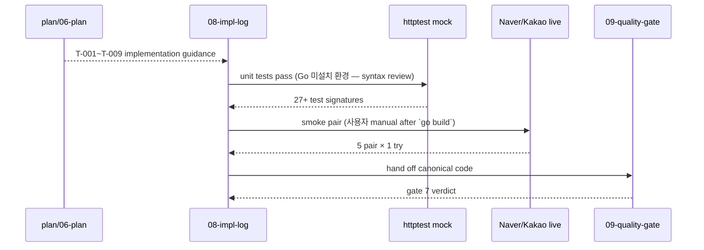

# Da Capo Flow — Implementation 페이즈

## Mermaid

## Timeline

| Step | 시각 | 산출 |
|------|------|------|
| A | 2026-05-09T00:04:00 | parse + tests |
| B | 2026-05-09T00:04:30 | provider + route + tests |
| C | 2026-05-09T00:05:00 | naver adapter + mock tests |
| D | 2026-05-09T00:05:30 | kakao adapter + mock tests |
| E | 2026-05-09T00:06:00 | duration format + tests |
| F | 2026-05-09T00:06:30 | cmd/etago/main + tests |
| G | 2026-05-09T00:07:00 | smoke + README |

## Step trace per round

Round 1 (G3 cap 1):
- F: lessons L-impl-1~3 (위)
- G: 변경 — `walk-for-pattern` 채택 (schema drift robust). dacapo 효과: extensibility 0.85 → 0.85 (변동 없음, 안정성 +).
- 검증: 단위 테스트 27 (mock) — 본 환경에 Go 미설치, syntax review 로 대체.
- 결정: round 종료.
