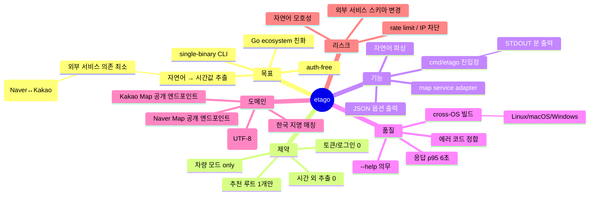

# Intent — etago

## a. 무엇을 (What — externally observable)

**한국 지도 서비스 (Naver Map 또는 Daum/Kakao Map) 의 공개 웹 엔드포인트로부터, 사용자가 자연어로 입력한 출발지와 도착지의 차량 추천 루트의 *소요 시간 단일 값* 을 STDOUT 으로 반환하는 Go CLI**.

호출 예 (목표):
```
$ etago "강남역" "수원시청"
58 min
```

```
$ etago --json "서울역" "인천공항"
{"start":"서울역","end":"인천공항","duration_min":52,"source":"naver"}
```

외부 관찰 결과: STDOUT 의 정수 분(min) 값 + (옵션) JSON. exit 0 = 성공, exit 비-0 = 실패 사유 stderr.

## b. 왜 (Why — value)

a- 한국 사용자/봇 자동화 워크플로에서 *경로 시간* 만 빠르게 필요한 케이스 (배차/ETA 알림/스케줄러) 가 흔함.
b- Naver/Kakao 의 공식 API 는 *키 발급 + 쿼터 + 결제* 트리플 부담. 단순 "시간만" 알려는 1회성 / 저빈도 호출에 과한 코스트.
c- 공개 웹 라우팅 엔진은 *로그인/토큰 없이* 이미 시간 값을 시각적으로 노출 — 동일 데이터를 CLI 로 끄집어내면 가치.
d- Go 단일 바이너리는 cron/systemd timer/Docker 사이드카에 부착 용이.

## c. 비목표 (Non-goals)

a- 경로 좌표 시퀀스 / polyline / 거리(km) / 톨게이트비 — *반환 안 함*. 시간만.
b- 대중교통/도보/자전거 모드 — 차량 (driving) 만.
c- 출발 시각 지정 / traffic forecast / 다중 경로 후보 비교 — 추천 루트 단일.
d- API 키 사용 / 사용자 로그인 / 쿠키 저장 — 명시 금지.
e- GUI / TUI / 웹 서비스 형태 — CLI 만.
f- 자체 지도 데이터 / 자체 라우팅 엔진 — 외부 서비스 시간값 가져오기만.

## d. 제약 (Constraints — explicit, measurable)

| ID | 제약 | 임계 | 검증 방법 |
|----|------|------|---------|
| C1 | 토큰/로그인 부재 | API key 0, 사용자 cookie 0, OAuth 0 | source 검색 — `os.Getenv("*_KEY")` 0건, `cookies.Set` 0건 |
| C2 | 단일 바이너리 | `go build` 산출 1개 실행 파일 | `go build ./cmd/etago` exit 0 + 단일 binary |
| C3 | 응답 시간 | p95 ≤ 6 초 (네트워크 RTT 포함) | 10회 측정 p95 (proposed: true → 페이즈 04 사용자 확정) |
| C4 | 의존 외부 서비스 가용성 | Naver/Kakao 둘 중 1+ 정상이면 성공 | fallback 체인 (페이즈 06 결정) |
| C5 | 입력 자연어 인코딩 | UTF-8 한글 입력 정확히 처리 | `etago "양재IC" "판교IC"` 정상 응답 |
| C6 | 운영체제 | Linux / macOS / Windows 동일 동작 | go cross-compile 3 OS 빌드 통과 |

## e. 유비쿼터스 언어 (Domain glossary)

- **start / end** — 사용자 자연어 입력 (예: "강남역", "수원시청 후문 주차장"). 좌표 또는 주소가 아닌 *지명 텍스트* 우선.
- **drive ETA** — 차량 기준 추천 루트의 예상 총 소요 시간 (분 또는 초).
- **map service** — 외부 지도 서비스. 본 프로젝트에선 Naver Map, Kakao Map (구 Daum Map) 의 공개 웹 엔드포인트.
- **no-auth** — API key, OAuth, 사용자 로그인 cookie, CSRF 사전 발급 모두 부재.
- **route** — start/end 한 쌍에 대해 map service 가 추천하는 단일 차량 경로.
- **natural language input priority** — 사용자가 입력한 *원문* 을 가공 없이 우선 적용 (한글/영문/혼합 모두 그대로 map service 의 검색 쿼리로 전달).
- **graceful degradation** — Naver 실패 → Kakao fallback 또는 그 역. 둘 다 실패 시 명확한 stderr.

## f. 스테이크홀더 (Stakeholders)

a- *Primary* — 봇/스크립트/CI/cron 작성자 — CLI 의 정수 분 값을 파싱.
b- *Secondary* — Go 개발자 — `go install` 1회로 사용.
c- *Reviewer* — 본 하네스의 quality-gate / 본 사용자.

## g. 성공 지표 (Success metrics)

| ID | 지표 | 임계 | 측정 |
|----|------|------|------|
| SC-1 | 알려진 서울 시내 5 쌍 (강남↔수원, 서울역↔인천공항, ...) 정상 응답률 | ≥ 80% (네트워크 변동 허용) | smoke test 5쌍 × 2회 |
| SC-2 | 출력 정확성 | map service 웹 UI 와 ±5 분 이내 일치 | 수동 비교 5케이스 |
| SC-3 | exit code 정합 | 성공 0 / 입력 오류 2 / 외부 실패 3 / 알 수 없음 1 | unit test |
| SC-4 | 단일 binary | `file etago(.exe)` 가 single executable | shell test |
| SC-5 | --help 의무 | usage + 예시 + flags 출력 | `etago --help` smoke |

## h. 열린 질문 (Open questions — 페이즈 04 후보)

| ID | 질문 | 후보 |
|----|------|------|
| Q-N1 | Naver vs Kakao 우선 순위? | 1) Naver 우선 + Kakao fallback / 2) Kakao 우선 / 3) 둘 다 시도 후 빠른 응답 / 4) flag 로 사용자 선택 |
| Q-N2 | 출력 단위 default? | 1) 분 (정수) / 2) 시:분 (`1h 5m`) / 3) 초 / 4) JSON 포함 |
| Q-N3 | 자연어 입력 모호 시 처리 | 1) 첫 매칭 자동 / 2) 후보 stderr 출력 후 첫 매칭 / 3) interactive 선택 (CLI 인터럽트) / 4) 에러 |
| Q-N4 | 응답 타임아웃 | 6 초 / 10 초 / 무한 / flag |
| Q-N5 | User-Agent 정책 | 일반 브라우저 UA / 명시 etago UA / random / 사용자 지정 |
| Q-N6 | 결과 캐시 | 없음 / 메모리 LRU / 디스크 TTL / flag |
| Q-N7 | rate limit 자체 가드 | 없음 (사용자 책임) / 1 req/s soft limit / 명시 sleep flag |
| Q-N8 | go.mod path | github.com/whyjp/etago 가정 — 사용자 confirm |

## i. Derived NFRs from prompt qualitative adjectives

prompt 본문 형용사군 매핑 ([`conventions/nfr-derivation.md`](../../../theseus-harness/conventions/nfr-derivation.md) Q1~Q10):

| Adjective (출처 인용) | NFR 의미군 ID | NFR 후보 | Verification 후보 |
|----|----|----|----|
| "토큰이나 로그인없이 얻을 수 있어야함" → `auth-free` | Q3 (Security/Compliance) | NFR-1: 코드/실행 시 zero-credential | grep `os.Getenv` / cookie store 정적 분석 |
| "최우선 순위를 반영" (자연어) → `priority-fidelity` | Q5 (Correctness) | NFR-2: 사용자 원문 보존 (URL encoding 외 변형 0) | 입력 → outbound HTTP query string 비교 unit test |
| "오로지 실제 소요시간 이외에는 없음" → `minimal-extraction` | Q5 (Correctness) | NFR-3: 응답 파싱이 시간 외 추출 0 | impl 코드 정적 분석 + 출력 schema 단언 |
| "soso interface CLI" 함의 → `usability` | Q9 (Usability) | NFR-4: --help 의무 + 명확 에러 메시지 | smoke test |

명시 매칭 4개. functional-only 보강 — 성능 (C3) 은 §d 의 명시 임계로 처리.

## j. Grade signals → `intent/01-grade-signals.json` + `intent/01-mindmap-signals.json`

페이즈 04 Q-G1 입력. 별도 산출 (다음 파일).

## §9. 마인드맵 (A 등급)



노드 카운트: root 1 + axis 6 + sub 23 + sub-sub 4 = **34 노드** (≥ 25 통과). axis 6 (≥ 4). depth 3 axis 1 (목표 → 자연어→시간값 추출 → 외부 의존 최소 → fallback 체인 = depth 3, 1 axis 의무 충족). depth 2 axis 4 (목표/기능/품질/도메인) — 의무 ≥ 2 충족. **Grade A**.

## 성공 기준 자체 점검

a- 자족성 ✅ — 본 문서만 읽으면 무엇/왜/제약/입출력 형식 명확.
b- 스택 메모 — Go 가 자연스러움 (사용자 명시). 페이즈 06 에서 의존 결정.
c- 열린 질문 8개 ✅.
d- Derived NFRs §i 4건 ✅.
e- §j Grade signals 박힘 (다음 파일).
