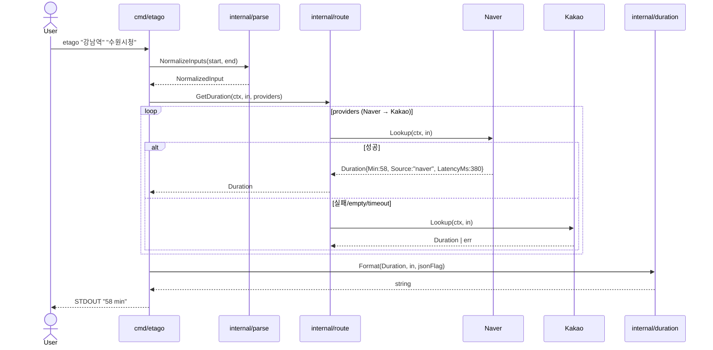
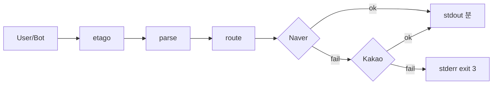
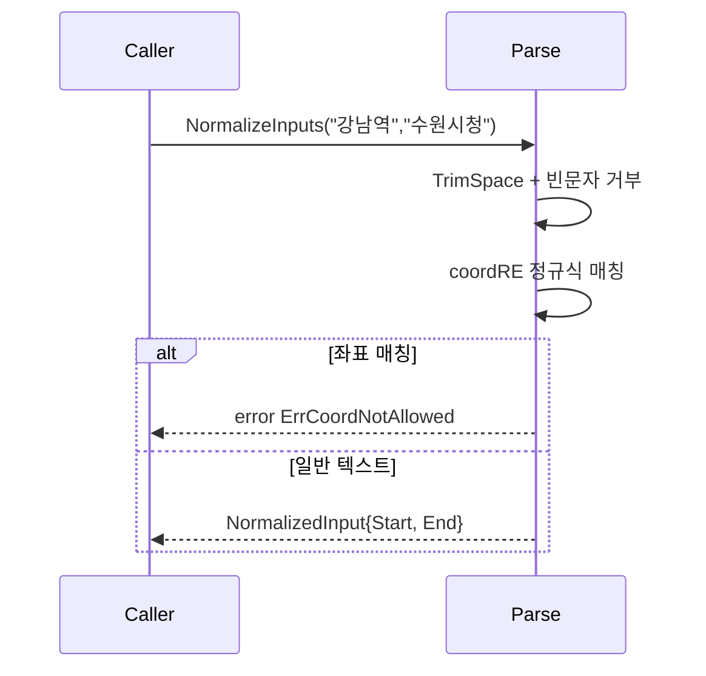
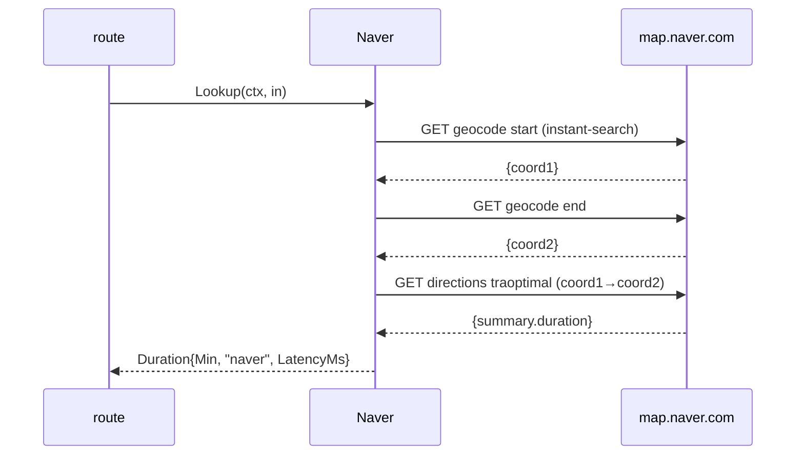
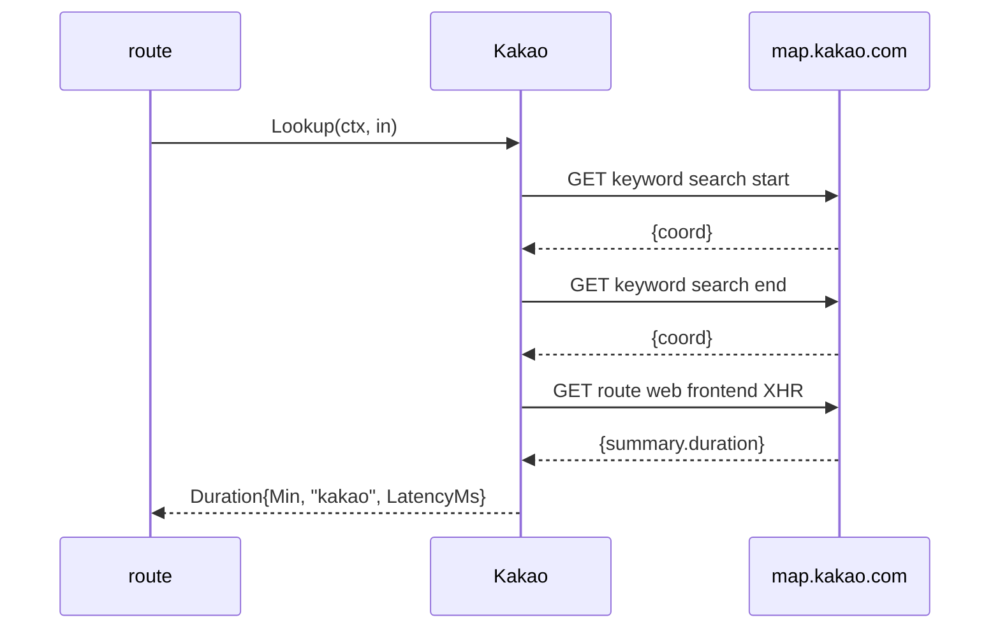
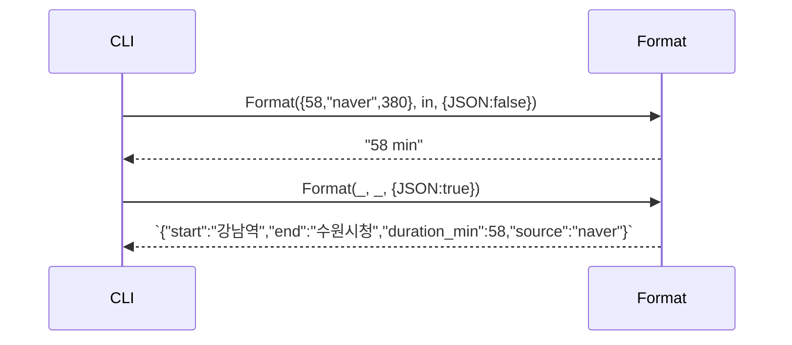
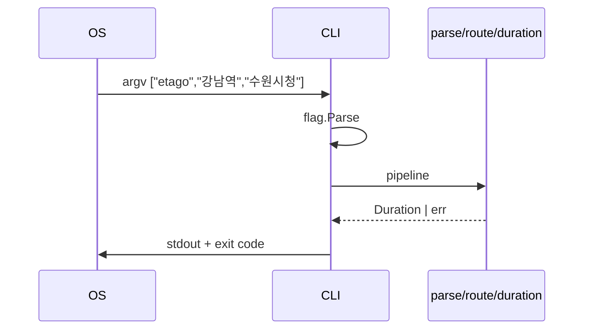

# Plan — etago (canonical, post-tournament + post-dacapo)

Universe 1 (Naver-first sequential) + dacapo lessons (Provider 인터페이스 + LatencyMs).

## 1. 파일 경로 (9)

| 경로 | 책임 |
|------|------|
| `etago/cmd/etago/main.go` | CLI 진입점 + flag 파싱 + exit code |
| `etago/internal/parse/input.go` | 자연어 정규화 + 좌표 거부 |
| `etago/internal/route/provider.go` | `Provider` 인터페이스 정의 |
| `etago/internal/route/naver.go` | Naver web adapter (Provider conformant) |
| `etago/internal/route/kakao.go` | Kakao web adapter (Provider conformant) |
| `etago/internal/route/route.go` | sequential `[]Provider` orchestration |
| `etago/internal/duration/format.go` | 분/JSON 출력 |
| `etago/go.mod` | `module github.com/whyjp/etago / go 1.22` |
| `etago/README.md` | quickstart + Windows cp949 hint |
| `etago/tests/smoke_test.go` | 실 네트워크 smoke (build tag `smoke`) |

(파일 수 9 → 단위 테스트 파일 별도, 페이즈 08 에서 ≥ 5 추가)

## 2. 다이어그램 + 인터페이스

### sequenceDiagram (전체)



### graph (use-case)



### 인터페이스 정의 (4)

```go
// internal/parse
type NormalizedInput struct {
    Start string // 원문 보존 (UTF-8). 좌표 거부됨.
    End   string
}
func NormalizeInputs(start, end string) (NormalizedInput, error)

// internal/route
type Duration struct {
    Min       int    // 분 정수 (round)
    Source    string // "naver" | "kakao"
    LatencyMs int    // request → response duration
}
type Provider interface {
    Name() string
    Lookup(ctx context.Context, in NormalizedInput) (Duration, error)
}
func GetDuration(ctx context.Context, in NormalizedInput, providers []Provider) (Duration, error)

// internal/duration
type Options struct {
    JSON    bool
    Verbose bool
}
func Format(d Duration, in NormalizedInput, opts Options) string
```

## 3. TODO DAG

| ID | 설명 | 의존 | 완료 조건 |
|----|------|------|---------|
| T-001 | go.mod + 디렉터리 골격 + placeholder main | — | `go build ./...` exit 0 |
| T-002 | parse.NormalizeInputs + 단위 테스트 (≥ 5 케이스) | T-001 | `go test ./internal/parse` exit 0 |
| T-003 | Provider 인터페이스 + Naver adapter (mock + 실 endpoint reverse-engineering 의무) | T-001 | mock 단위 테스트 + 1회 실 호출 검증 |
| T-004 | Kakao adapter | T-001 | 동일 |
| T-005 | route.GetDuration sequential orchestrator + fallback | T-003, T-004 | mock 통합 테스트 (8 fallback 케이스) |
| T-006 | duration.Format (분/JSON, verbose) | T-001 | 단위 테스트 |
| T-007 | cmd/etago/main.go (flag, exit code, signal) | T-002, T-005, T-006 | `etago --help` exit 0 + smoke pair 1쌍 |
| T-008 | tests/smoke_test.go + cross-OS build | T-007 | smoke 5쌍 ≥ 4/5 + 3 OS go build |
| T-009 | README.md + 페이즈 14 핸드오프 | T-008 | 페이즈 09 게이트 + 페이즈 14 OK |

## 4. 모듈 의존 다이어그램 (per-module sequenceDiagram, ≥ 모듈 수)

### parse



### route (Naver path)



### route (Kakao path)



### duration



### cmd/etago



## 5. Data Structure Invariants

| Struct | Invariants | Topology | Access | Bounds |
|--------|-----------|----------|--------|--------|
| `NormalizedInput` | Start≠"", End≠"", non-coordinate, UTF-8 valid | flat | RO post-construction | len ≤ 256 chars each (검증) |
| `Duration` | Min ≥ 0, Source ∈ {"naver","kakao"}, LatencyMs ≥ 0 | flat | RO | Min ≤ 1440, LatencyMs ≤ 12000 |
| `[]Provider` | exactly 2 entries, Naver index 0, Kakao index 1 | linear | append-only at compile | len == 2 |
| `Options` (output) | JSON XOR (verbose가 stderr만) | flat | RO | — |

## 6. Test Surface Mapping

| Invariant | Test |
|-----------|------|
| NormalizedInput non-empty | `TestNormalize_emptyStart_returns2` |
| 좌표 거부 | `TestNormalize_coord_returns2` |
| UTF-8 보존 (NFR-2) | `TestNormalize_preservesUTF8` |
| Provider conformance | `TestNaver_implementsProvider`, `TestKakao_implementsProvider` |
| Naver mock 200 → Min | `TestNaver_parsesMockDuration` |
| Naver mock 5xx → fallback | `TestRoute_naver5xx_fallsBackToKakao` |
| Naver mock 4xx → input err | `TestRoute_naver4xx_returnsInputError_exit2` |
| 둘 다 fail → exit 3 | `TestRoute_bothFail_returnsExternalError_exit3` |
| Format minutes | `TestFormat_default` |
| Format JSON | `TestFormat_json` |
| exit code 매트릭스 | `TestMain_exitCodes` |
| --help | `TestMain_helpFlag_exit0` |

## 7. Error Handling / Fallback Policy

| 상황 | 동작 | exit |
|------|------|------|
| 입력 좌표 (regex `^-?\d+\.\d+,-?\d+\.\d+$`) | parse 거부 stderr | **2** |
| 입력 빈 / whitespace only | parse 거부 stderr | **2** |
| Naver HTTP 5xx | Kakao fallback | 0 / **3** |
| Naver HTTP 4xx | parse 거부 (input error) | **2** |
| Naver timeout (per-source 6s) | Kakao fallback | 0 / **3** |
| Naver empty path / duration=0 | Kakao fallback | 0 / **3** |
| Naver parse 실패 (응답 schema 변경) | Kakao fallback | 0 / **3** |
| Kakao 도 동일 패턴 | aggregate stderr | **3** |
| Total > 12s | aggregate stderr "all timed out" | **3** |
| panic / unknown | recover + stderr | **1** |

## 8. Implementation Guidance per TODO

### T-002 — parse

```go
package parse
var coordRE = regexp.MustCompile(`^-?\d+\.\d+,-?\d+\.\d+$`)
type NormalizedInput struct{ Start, End string }
var (
    ErrEmpty           = errors.New("start/end must be non-empty")
    ErrCoordNotAllowed = errors.New("coordinate input is not allowed; use a place name")
)
func NormalizeInputs(start, end string) (NormalizedInput, error) {
    s, e := strings.TrimSpace(start), strings.TrimSpace(end)
    if s == "" || e == "" { return NormalizedInput{}, ErrEmpty }
    if coordRE.MatchString(s) || coordRE.MatchString(e) { return NormalizedInput{}, ErrCoordNotAllowed }
    if utf8.RuneCountInString(s) > 256 || utf8.RuneCountInString(e) > 256 { return NormalizedInput{}, errors.New("input too long") }
    return NormalizedInput{Start:s, End:e}, nil
}
```

### T-003 — Naver adapter

알고리즘 (web reverse-engineering, implementer 가 실 호출로 검증):
```
1. instant-search GET https://map.naver.com/p/api/search/instant-search?query={url-escape(start)}&type=place
   응답 후보 schema: {"place":{"items":[{"x":mapx, "y":mapy, ...}]}}
2. 동일 for end → coord_e
3. directions GET https://map.naver.com/p/api/directions/{sLng},{sLat}/{eLng},{eLat}?option=traoptimal
   응답 후보: {"route":{"traoptimal":[{"summary":{"duration":<ms>, ...}}]}}
4. duration_ms → minute = int(math.Round(float64(ms)/60000))

HTTP 의무 헤더:
  User-Agent: Mozilla/5.0 (...) Chrome/120.0.0.0 Safari/537.36
  Accept: application/json
  Accept-Language: ko-KR,ko;q=0.9
  Referer: https://map.naver.com/
```

> **implementer NOTE**: Naver web schema 는 비공식 — 위 필드 경로는 *후보*. 실 호출 시 응답 dump → 정정. parse fail 시 fallback 트리거 (의도 §d C4).

### T-004 — Kakao adapter

알고리즘:
```
1. keyword 검색 GET https://map.kakao.com/?q={escape(start)} 의 해당 페이지 또는
   https://place.map.kakao.com/main/v/<placeId> 또는
   https://dapi.kakao.com/v2/local/search/keyword.json (이는 REST key 의무 — 인증 미필요 endpoint 우선 탐색)
2. 좌표 추출
3. route GET https://map.kakao.com/route/?... 또는 web frontend XHR (Referer: https://map.kakao.com/)
4. summary.duration (s) → minute = int(math.Round(float64(s)/60))

HTTP 헤더 동일 패턴.
```

> **implementer NOTE**: Kakao 의 인증 없는 web XHR endpoint 가 가장 안정. `dapi.kakao.com` 키 의무 endpoint 회피.

### T-005 — route orchestration

```go
package route
type Duration struct{ Min int; Source string; LatencyMs int }
type Provider interface { Name() string; Lookup(ctx context.Context, in parse.NormalizedInput) (Duration, error) }

var (
    ErrEmptyPath       = errors.New("provider returned empty path")
    ErrInputRejected   = errors.New("provider rejected input (4xx)")
    ErrAllSourcesFail  = errors.New("all map sources failed")
)

func GetDuration(ctx context.Context, in parse.NormalizedInput, providers []Provider) (Duration, error) {
    var errs []error
    for _, p := range providers {
        sub, cancel := context.WithTimeout(ctx, 6*time.Second)
        d, err := p.Lookup(sub, in)
        cancel()
        if err == nil && d.Min > 0 { return d, nil }
        if errors.Is(err, ErrInputRejected) { return Duration{}, err }  // no fallback on 4xx
        errs = append(errs, fmt.Errorf("%s: %w", p.Name(), err))
    }
    return Duration{}, fmt.Errorf("%w: %v", ErrAllSourcesFail, errs)
}
```

### T-006 — format

```go
package duration
type Options struct{ JSON, Verbose bool }
func Format(d route.Duration, in parse.NormalizedInput, opts Options) string {
    if opts.JSON {
        b, _ := json.Marshal(struct{
            Start, End  string
            DurationMin int    `json:"duration_min"`
            Source      string
        }{in.Start, in.End, d.Min, d.Source})
        return string(b)
    }
    return fmt.Sprintf("%d min", d.Min)
}
```

### T-007 — main

```go
package main
func main() {
    var (
        asJSON  = flag.Bool("json", false, "emit JSON")
        timeout = flag.Duration("timeout", 12*time.Second, "total timeout")
        verbose = flag.Bool("verbose", false, "log per-source latency to stderr")
        ua      = flag.String("ua", defaultUA, "User-Agent override")
        source  = flag.String("source", "auto", "auto|naver|kakao")
    )
    flag.Usage = printUsage
    flag.Parse()
    if flag.NArg() != 2 { flag.Usage(); os.Exit(2) }

    in, err := parse.NormalizeInputs(flag.Arg(0), flag.Arg(1))
    if err != nil { fmt.Fprintln(os.Stderr, err); os.Exit(2) }

    ctx, cancel := context.WithTimeout(context.Background(), *timeout)
    defer cancel()

    providers := buildProviders(*source, *ua)
    d, err := route.GetDuration(ctx, in, providers)
    if err != nil {
        if errors.Is(err, parse.ErrCoordNotAllowed) || errors.Is(err, route.ErrInputRejected) {
            fmt.Fprintln(os.Stderr, err); os.Exit(2)
        }
        fmt.Fprintln(os.Stderr, err); os.Exit(3)
    }
    if *verbose { fmt.Fprintf(os.Stderr, "[%s] %dms\n", d.Source, d.LatencyMs) }
    fmt.Println(duration.Format(d, in, duration.Options{JSON:*asJSON}))
}
```

### T-008 — smoke + cross-OS

```bash
go test -tags=smoke ./tests/...
GOOS=linux GOARCH=amd64 go build -o dist/etago-linux-amd64 ./cmd/etago
GOOS=darwin GOARCH=arm64 go build -o dist/etago-darwin-arm64 ./cmd/etago
GOOS=windows GOARCH=amd64 go build -o dist/etago-windows-amd64.exe ./cmd/etago
```

### T-009 — README

quickstart, 사용법, --help 출력 예제, exit code 표, Windows `chcp 65001` hint, 실패 시 stderr 디버깅 (`--verbose`).
