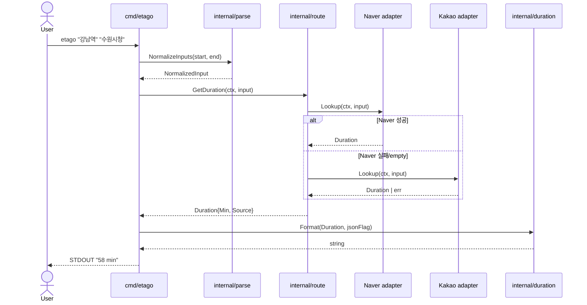
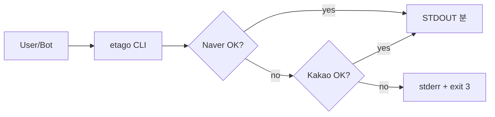
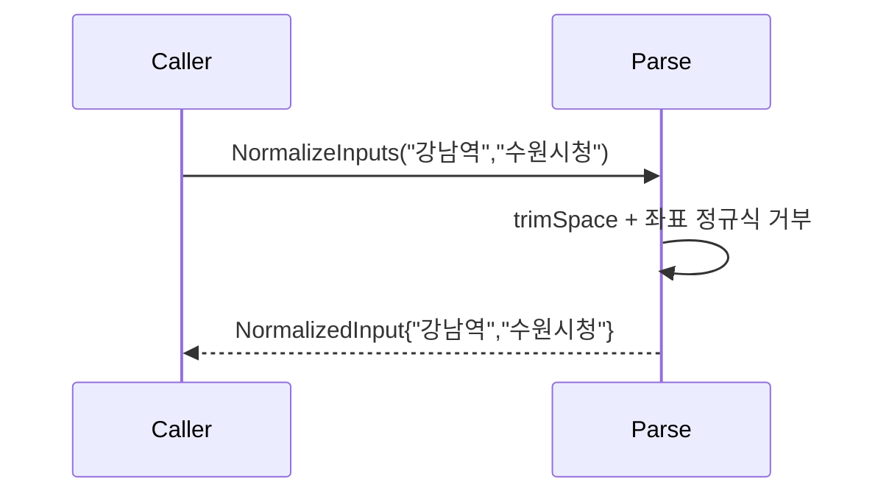
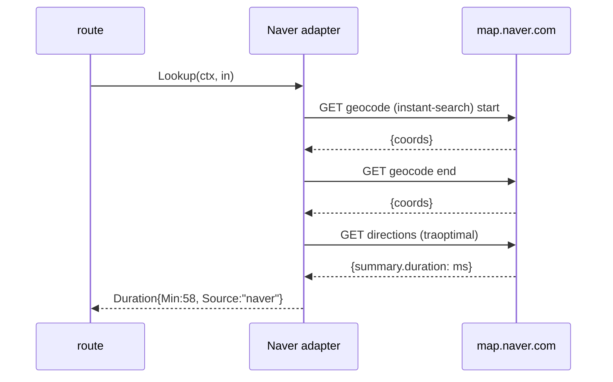
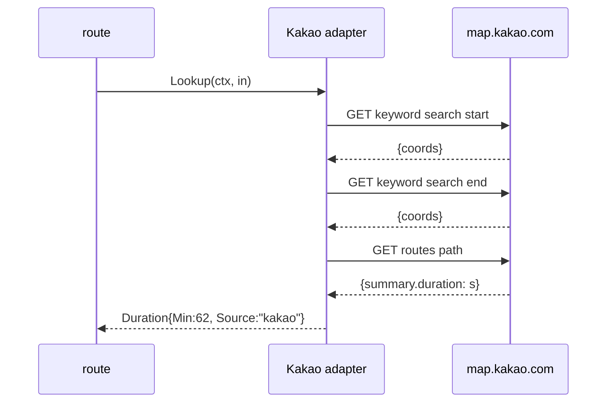
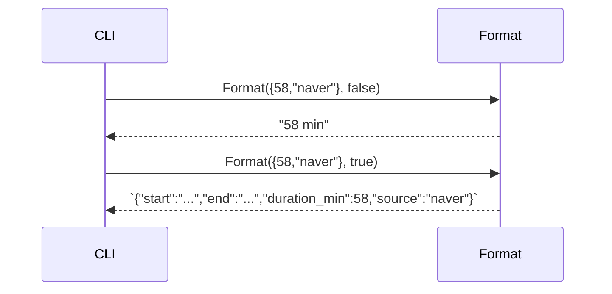

# Plan — Universe 1 (Naver-first sequential)

## 1. 파일 경로 (≥ 5)

| 경로 | 책임 |
|------|------|
| `etago/cmd/etago/main.go` | CLI 진입점, flag 파싱, exit code |
| `etago/internal/parse/input.go` | 자연어 입력 정규화 + 좌표 거부 |
| `etago/internal/route/naver.go` | Naver web API adapter |
| `etago/internal/route/kakao.go` | Kakao web API adapter |
| `etago/internal/route/route.go` | adapter 호출 orchestration (sequential) |
| `etago/internal/duration/format.go` | 시간 출력 포매팅 (분/JSON) |
| `etago/go.mod` | `module github.com/whyjp/etago / go 1.22` |
| `etago/README.md` | 사용법 + Windows cp949 hint |
| `etago/tests/smoke_test.go` | 실 네트워크 smoke (build tag `smoke`) |

## 2. 다이어그램 + 인터페이스

### Mermaid sequenceDiagram (전체 흐름)



### Mermaid graph (use-case)



### 인터페이스 정의 (≥ 3)

```go
// internal/parse
type NormalizedInput struct {
    Start string // 원문 보존, 좌표 거부됨
    End   string
}
func NormalizeInputs(start, end string) (NormalizedInput, error)

// internal/route
type Duration struct {
    Min    int    // 분 정수 (반올림)
    Source string // "naver" | "kakao"
}
type Provider interface {
    Name() string
    Lookup(ctx context.Context, in NormalizedInput) (Duration, error)
}
func GetDuration(ctx context.Context, in NormalizedInput) (Duration, error) // sequential

// internal/duration
func Format(d Duration, asJSON bool) string
```

## 3. TODO DAG

| ID | 설명 | 의존 | 완료 조건 |
|----|------|------|---------|
| T-001 | go.mod + 디렉터리 골격 | — | `go build ./...` exit 0 (placeholder main) |
| T-002 | `internal/parse.NormalizeInputs` + 단위 테스트 | T-001 | go test ./internal/parse exit 0 |
| T-003 | Naver web endpoint 분석 + adapter | T-001 | mock fixture httptest pass |
| T-004 | Kakao web endpoint 분석 + adapter | T-001 | mock fixture httptest pass |
| T-005 | `internal/route.GetDuration` orchestration (sequential) | T-003, T-004 | mock 통합 테스트 pass |
| T-006 | `internal/duration.Format` (분/JSON) | T-001 | unit test pass |
| T-007 | `cmd/etago/main.go` CLI flag + exit code | T-002, T-005, T-006 | `etago --help` exit 0 + smoke pair 1쌍 |
| T-008 | Smoke test 5쌍 + cross-OS build | T-007 | smoke ≥ 4/5 + 3 OS go build 통과 |
| T-009 | README + handoff | T-008 | 페이즈 14 OK |

## 4. 모듈 의존 다이어그램 (per-module sequenceDiagram)

### parse



### route (Naver path)



### route (Kakao fallback)



### duration



## 5. Data Structure Invariants

| Struct | Invariants | Topology | Access | Bounds |
|--------|-----------|----------|--------|--------|
| `NormalizedInput` | Start≠"", End≠"", non-coordinate | flat | RO post-construction | len ≤ 256 chars each |
| `Duration` | Min ≥ 0, Source ∈ {"naver","kakao"} | flat | RO | Min ≤ 1440 (24h sanity) |
| Provider chain (sequential) | Naver 항상 1차, Kakao 2차 | linear | append-only at compile time | exactly 2 providers |

## 6. Test Surface Mapping

| Invariant | Test signature |
|-----------|---------------|
| NormalizedInput.Start≠"" | `TestNormalizeInputs_emptyStart_returnsError` |
| 좌표 거부 | `TestNormalizeInputs_coordinate_rejected` |
| 원문 보존 (NFR-2) | `TestNormalizeInputs_preservesUTF8` |
| Naver 응답 → Min 정수 | `TestNaverAdapter_parsesDuration_mock` |
| Kakao 응답 → Min 정수 | `TestKakaoAdapter_parsesDuration_mock` |
| fallback Naver → Kakao | `TestRoute_naverFails_fallsBackToKakao_mock` |
| fallback HTTP 4xx no-fallback | `TestRoute_naver4xx_noFallback_returnsInputError` |
| Format 분 단일 라인 | `TestFormat_minutes_default` |
| Format JSON | `TestFormat_jsonFlag` |
| exit code 매트릭스 | `TestMain_exitCodeMatrix` |

## 7. Error Handling / Fallback Policy

| 상황 | 동작 | exit |
|------|------|------|
| 입력 좌표 (lat,lng) | parse 거부, "coordinate not allowed" | 2 |
| 입력 빈 문자열 | parse 거부 | 2 |
| Naver 5xx | Kakao fallback | 0 (성공 시) / 3 (Kakao 도 실패) |
| Naver 4xx | parse 거부 (input error) | 2 |
| Naver timeout (6s) | Kakao fallback | 0 / 3 |
| Naver empty path | Kakao fallback | 0 / 3 |
| 두 source 모두 실패 | stderr "all map sources failed: ..." | 3 |
| panic / unknown | recover + stderr | 1 |

## 8. Implementation Guidance per TODO

### T-002 (`internal/parse.NormalizeInputs`)

```go
func NormalizeInputs(start, end string) (NormalizedInput, error) {
    s, e := strings.TrimSpace(start), strings.TrimSpace(end)
    if s == "" || e == "" { return NormalizedInput{}, ErrEmpty }
    // 좌표 패턴 ([0-9.]+,[0-9.]+) 거부
    if coordRE.MatchString(s) || coordRE.MatchString(e) {
        return NormalizedInput{}, ErrCoordNotAllowed
    }
    return NormalizedInput{Start:s, End:e}, nil
}
```

### T-003 (`internal/route/naver.go`)

알고리즘 (의사코드):
```
1. GET https://map.naver.com/p/api/search/instant-search?query={start}&type=all
   → 첫 매칭 좌표 추출 (lat=mapy, lng=mapx 필드 또는 유사)
2. 동일 GET for end
3. GET https://map.naver.com/p/api/directions/<sLat>,<sLng>/<eLat>,<eLng>?option=traoptimal&...
   → JSON `route.traoptimal[0].summary.duration` (ms 또는 s)
4. duration → 분 정수 = round(duration_ms / 60000)
HTTP 헤더: User-Agent (Chrome stable), Accept-Language: ko, Referer: https://map.naver.com/
```

> 주의: Naver web schema 는 비공식 — 응답 필드명은 *호출 시점에 reverse-engineering* (페이즈 08 implementer 가 실 호출로 검증). 본 plan 의 필드명은 *후보* — implementer 가 실제 응답으로 정정.

### T-004 (`internal/route/kakao.go`)

알고리즘:
```
1. GET https://map.kakao.com/?q=<start> 또는 https://dapi.kakao.com/v2/local/search/keyword.json (인증 미필요 endpoint 우선 탐색)
   → 첫 매칭 좌표 (x=lng, y=lat)
2. 동일 for end
3. GET https://map.kakao.com/api/dapi/route/v2/...?origin=...&destination=... (web frontend XHR — 인증 없이 Referer 만)
   → JSON 의 `routes[0].summary.duration` (s)
4. duration → 분 정수 = round(duration_s / 60)
```

> 주의: Kakao 의 `dapi.kakao.com` 은 일부 endpoint 가 REST API key 의무. 인증 없는 web frontend XHR 엔드포인트 우선 탐색. 둘 다 안 되면 페이즈 11 회귀 + plan 업데이트 의무.

### T-005 (`internal/route/route.go`)

```go
func GetDuration(ctx context.Context, in NormalizedInput) (Duration, error) {
    // Naver 시도 (per-source 6s)
    nctx, cancel := context.WithTimeout(ctx, 6*time.Second)
    defer cancel()
    if d, err := naver.Lookup(nctx, in); err == nil { return d, nil }
    // Kakao fallback
    kctx, cancel2 := context.WithTimeout(ctx, 6*time.Second)
    defer cancel2()
    if d, err := kakao.Lookup(kctx, in); err == nil { return d, nil }
    return Duration{}, ErrAllSourcesFailed
}
```

### T-006 (`internal/duration/format.go`)

```go
func Format(d Duration, asJSON bool, in NormalizedInput) string {
    if asJSON {
        out, _ := json.Marshal(map[string]any{
            "start":         in.Start,
            "end":           in.End,
            "duration_min":  d.Min,
            "source":        d.Source,
        })
        return string(out)
    }
    return fmt.Sprintf("%d min", d.Min)
}
```

### T-007 (`cmd/etago/main.go`)

```go
// flags: --json --timeout=6s --source=naver|kakao|auto --ua --help
// args: 위치 2개 (start, end)
// exit code:
//   0 success
//   1 unknown
//   2 input error (parse fail / 자연어 매칭 0)
//   3 external (all sources failed)
```

### T-008 (Smoke + cross-OS)

```bash
go test -tags=smoke ./tests/...
GOOS=linux GOARCH=amd64 go build ...
GOOS=darwin GOARCH=arm64 go build ...
GOOS=windows GOARCH=amd64 go build ...
```

### T-009 (README)

- Quickstart: `go install github.com/whyjp/etago/cmd/etago@latest`
- 사용법 + 예제 + 출력 옵션 + Windows cp949 hint (`chcp 65001`)
