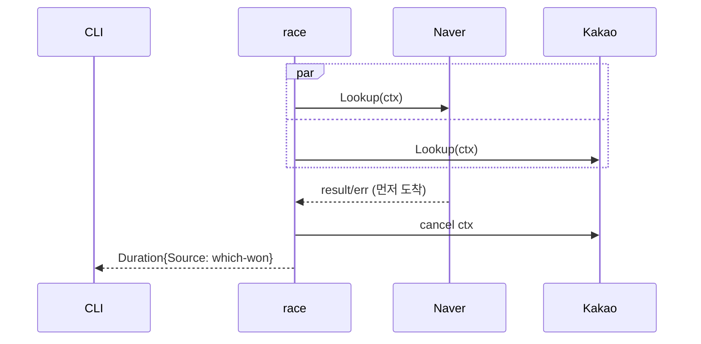
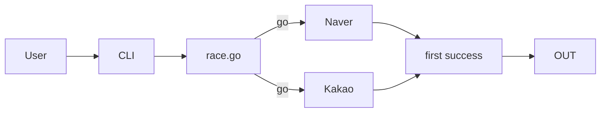

# Plan — Universe 2 (Concurrent Race)

## 1. 파일 경로

U1 과 동일 + `internal/route/race.go`. 9 파일.

## 2. 다이어그램 + 인터페이스

### sequenceDiagram (race)



### graph (use-case)



### 인터페이스

```go
type RaceResult struct {
    Duration
    LatencyMs int
}
func RaceProviders(ctx context.Context, in NormalizedInput, providers ...Provider) (RaceResult, error)
type Provider interface { Name() string; Lookup(ctx, in) (Duration, error) }
```

## 3. TODO DAG

T-001~T-006 = U1, + T-005a `route/race.go` 동시성 orchestrator.

## 4. 모듈 sequenceDiagram (모듈수만큼)

`parse`, `route/naver`, `route/kakao`, `route/race`, `duration` — 5개 (U1 의 4개 + race).

## 5. Data Structure Invariants

| Struct | Invariant |
|--------|----------|
| RaceResult | LatencyMs ≥ 0, Source ∈ providers |
| ctx cancellation | 첫 성공 즉시 cancel |

## 6. Test Surface

`TestRace_naverFasterThanKakao_naverWins`, `TestRace_kakaoFasterThanNaver_kakaoWins`, `TestRace_bothFail_returnsAggregate`.

## 7. Error Handling

둘 다 실패 → aggregate error (둘 다 stderr).

## 8. Implementation Guidance

```go
func RaceProviders(ctx, in, ps...) (RaceResult, error) {
    rctx, cancel := context.WithTimeout(ctx, 6*time.Second)
    defer cancel()
    type r struct{ d Duration; err error; ms int }
    ch := make(chan r, len(ps))
    start := time.Now()
    for _, p := range ps {
        go func(p Provider) {
            d, err := p.Lookup(rctx, in)
            ch <- r{d, err, int(time.Since(start).Milliseconds())}
        }(p)
    }
    var errs []error
    for range ps {
        x := <-ch
        if x.err == nil { return RaceResult{x.d, x.ms}, nil }
        errs = append(errs, x.err)
    }
    return RaceResult{}, fmt.Errorf("all failed: %v", errs)
}
```
