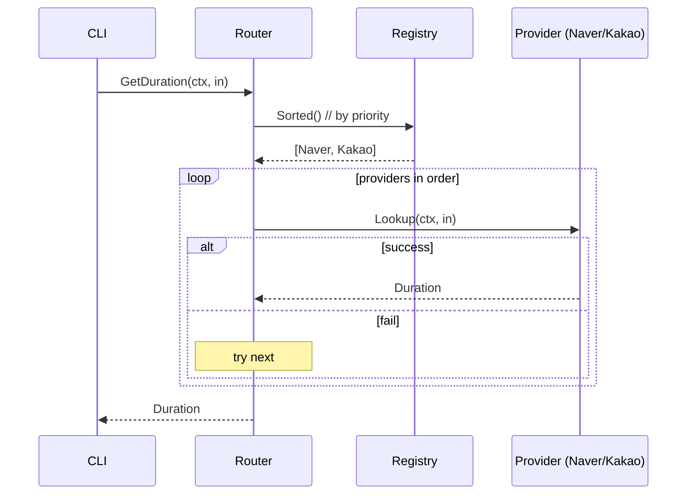
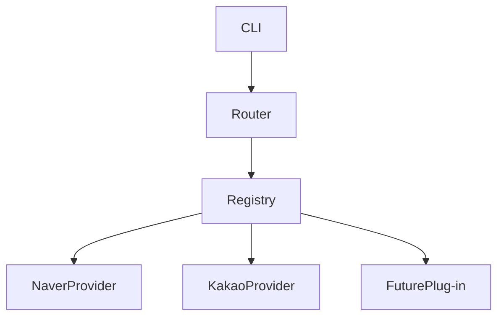

# Plan — Universe 3 (Router + Plug-in)

## 1. 파일 경로

U1 + `internal/route/registry.go` + `internal/route/router.go`. 10 파일.

## 2. 다이어그램 + 인터페이스

### sequenceDiagram



### graph



### 인터페이스

```go
type Provider interface {
    Name() string
    Priority() int
    Lookup(ctx, in) (Duration, error)
}
type Registry struct{ ... }
func (r *Registry) Register(p Provider)
func (r *Registry) Sorted() []Provider
type Router struct{ Reg *Registry }
func (rt *Router) GetDuration(ctx, in) (Duration, error)
```

## 3. TODO DAG

T-001~T-009 + T-005b registry + T-005c router.

## 4. 모듈 sequenceDiagram (5+ 모듈)

`parse`, `naver`, `kakao`, `registry`, `router`, `duration` — 6개.

## 5. Data Structure Invariants

| Struct | Invariant |
|--------|----------|
| Registry | sorted by priority, no duplicates |
| Provider | Priority() > 0 |
| Router | uses Registry exclusively (no direct provider ref) |

## 6. Test Surface

provider conformance test, registry insert/sort test, router fallback test.

## 7. Error Handling

router 가 단일 fallback 정책 적용 — provider 별 분기 X.

## 8. Implementation Guidance

```go
type Registry struct{ providers []Provider }
func (r *Registry) Register(p Provider) {
    r.providers = append(r.providers, p)
    sort.Slice(r.providers, func(i,j int) bool {
        return r.providers[i].Priority() > r.providers[j].Priority()
    })
}
func (rt *Router) GetDuration(ctx context.Context, in NormalizedInput) (Duration, error) {
    var errs []error
    for _, p := range rt.Reg.Sorted() {
        sub, cancel := context.WithTimeout(ctx, 6*time.Second)
        d, err := p.Lookup(sub, in)
        cancel()
        if err == nil { return d, nil }
        errs = append(errs, fmt.Errorf("%s: %w", p.Name(), err))
    }
    return Duration{}, fmt.Errorf("all providers failed: %v", errs)
}
// init()
func init() {
    Default.Register(&NaverProvider{priority:100})
    Default.Register(&KakaoProvider{priority:50})
}
```
