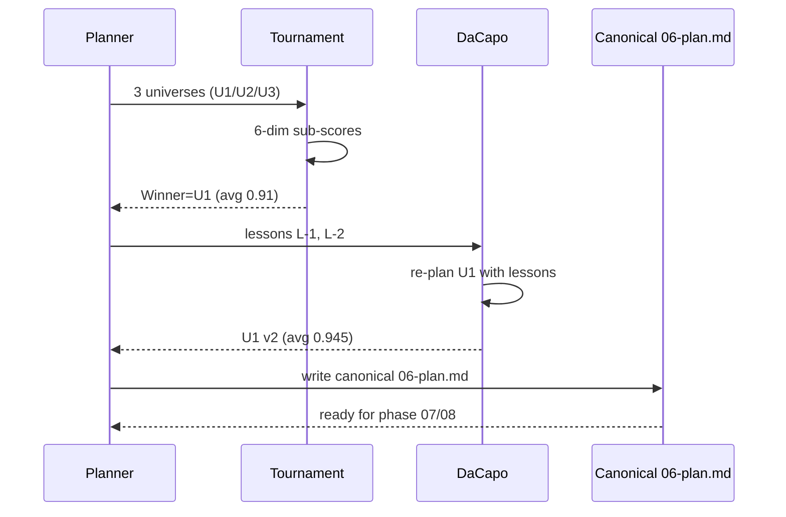

# Da Capo Flow — Plan 페이즈

## Mermaid

## Timeline

| Step | 시각 | 산출 |
|------|------|------|
| A | 2026-05-09T00:02:00 | tournament-01.md |
| B | 2026-05-09T00:02:30 | dacapo-rerun-01.md |
| C | 2026-05-09T00:03:00 | canonical 06-plan.md |

## Step trace per round

Round 1 (1회만, G3 cap):
- F: lessons 추출 (cross-universe 차이집합 + tournament reasoning)
- G: U1 v2 re-plan (Provider 인터페이스 + Latency 필드)
- 검증: 6-dim 재채점 — 0.91 → 0.945
- 결정: round 종료 (G3 dacapo 1회 의무 충족)
